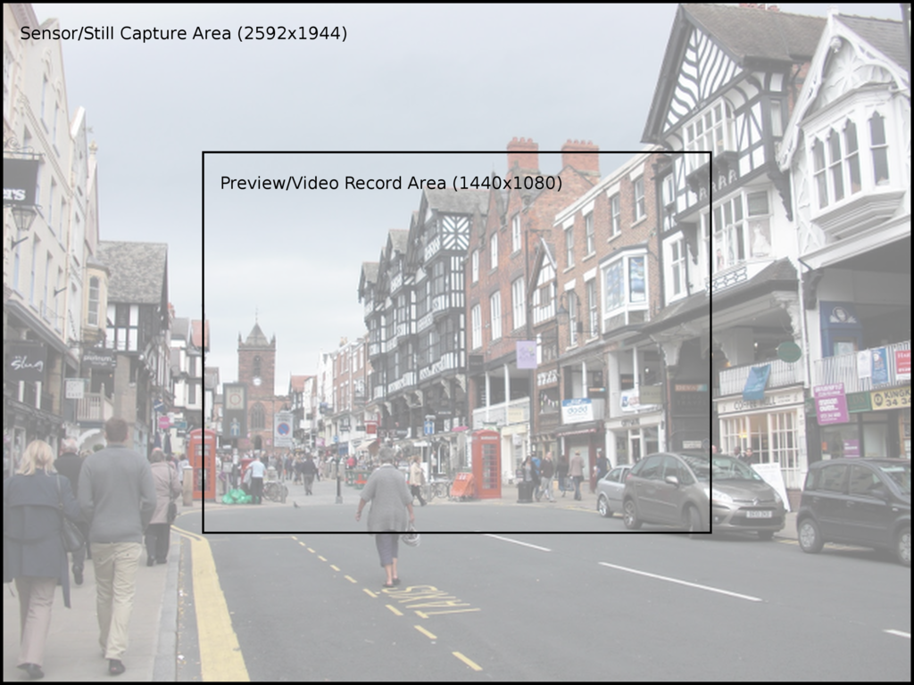
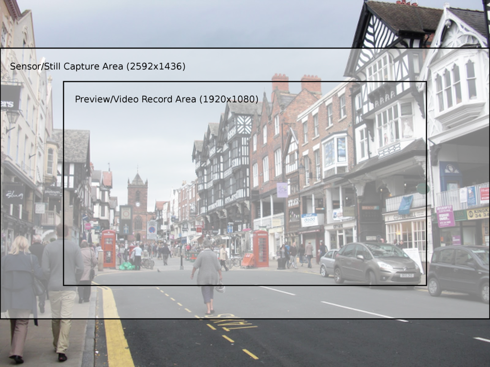

.. _camera_theory:

===============
Camera Hardware
===============

This chapter attempts to provide an overview of the operation of the camera
under various conditions, as well as to provide an introduction to the low
level software interface that picamera utilizes.

.. _preview_still_resolution:

Field of View
=============

One thing you may have noted while experimenting with the camera's preview mode
is that captured images typically show more than the preview. The reason for
this is that the camera does not (usually) use the full sensor area for preview
or video captures, but does for image captures. Specifically, the camera's
sensor has a resolution of 2592x1944 pixels (approximately 5 mega-pixels in
area), but only the 1440x1080 pixels in the center of the sensor are used for
previews or video (for resolutions with a 4:3 aspect ratio):

When still images are captured, the full sensor area is used and the resulting
image is scaled to the requested :attr:`~picamera.PiCamera.resolution`. This
usually results in a considerably larger field of view being observed in the
final image than was present in the preview shown before the capture.

If a wide-screen 16:9 aspect ratio is configured (1280x720 for example), then
the capture area and preview area will be as shown in the image below:

If you wish to ensure that previews and captures have the same field of view,
set the camera's :attr:`~picamera.PiCamera.resolution` to the maximum
(2592x1944). When the camera is set to its maximum resolution all operations
will attempt to use the full field of view, including previews and video
recording. Previews will work happily, albeit at a reduced frame rate of 15fps
(due to hardware limitations), and will now have the same field of view as
captured images::

    import time
    import picamera

    with picamera.PiCamera() as camera:
        camera.resolution = (2592, 1944)
        # The following is equivalent
        #camera.resolution = camera.MAX_IMAGE_RESOLUTION
        camera.start_preview()
        time.sleep(2)
        camera.capture('foo.jpg')

However, video recording does *not* work at this resolution (again, due to
hardware limitations).  Thankfully, a simple solution is available: the
``resize`` parameter. This can be used with all
:meth:`~picamera.PiCamera.capture` methods and the
:meth:`~picamera.PiCamera.start_recording` method. The ``resize`` parameter
causes the camera's output to be resized prior to encoding, allowing you to
produce full-frame captures and video recording at lower resolutions than
2592x1944. For example, the following code will produce a 1024x768 video
recording, captured from the full field of view of the camera::

    import picamera

    with picamera.PiCamera() as camera:
        camera.resolution = (2592, 1944)
        camera.start_preview()
        camera.start_recording('foo.h264', resize=(1024, 768))
        camera.wait_recording(30)
        camera.stop_recording()

Bear in mind that, as with the preview, full field of view video recordings
will have a framerate of 15fps.

.. note::

    One limitation to consider when using the ``resize`` parameter is that the
    full resolution has an aspect ratio of 4:3 and at present there are no
    facilities to crop this. Therefore, specifying any value for ``resize``
    which doesn't also have an aspect ratio of 4:3 will result in the output
    appearing squished.

.. versionchanged:: 1.0
    The *resize* parameter was first added in 1.0

.. _under_the_hood:

Under the Hood
==============

For those that wish to understand exactly why this discrepancy exists, and how
the methods mentioned above work, this section attempts to provide detail of
what's going on "under the hood".

Resolutions
-----------

From a software perspective, the Pi's camera has a couple of resolutions: the
capture resolution, which you cannot (directly) configure, and the output
resolution, which picamera exposes via the
:attr:`~picamera.PiCamera.resolution` attribute.

The camera's capture resolution defaults to the center 1440x1080 pixels of the
sensor. If the output :attr:`~picamera.PiCamera.resolution` is set to the
maximum (2592x1944), then the camera's capture resolution is also set to the
maximum (and the camera's framerate is reduced to 15fps). If the output
resolution is set to anything less, the capture resolution is set to the center
1440x1080 pixels (and the camera's framerate is restored to the default 30fps).

.. note::

    The capture resolution is actually slightly more complex than this. For the
    sake of simplicity the situation we're describing here applies when the
    requested output resolution has an aspect ratio of 4:3 (e.g. 640x480,
    1024x768, or the maximum resolution 2592x1944). When a wide-screen
    output resolution is requested (e.g. 1280x720) the capture resolution
    defaults to the center 1920x1080 pixels of the sensor.

    In other words, the default capture resolution has a height of 1080 and a
    width calculated from the aspect ratio of the configured output resolution.

The camera also has three ports, the still port, the video port, and the
preview port. The following sections describe how these ports are used by
picamera and how they influence the camera's resolutions.

The Still Port
--------------

Firstly, the still port. Whenever this is used to capture images, it (briefly)
forces the camera's capture resolution to the maximum so that images are
captured using the full area of the sensor. Once the capture is complete the
previous capture resolution is restored. If the preview is running at the time
of the capture you will briefly see the field of view increase and then
decrease again as this mode change occurs.

The output is subsequently scaled to the camera's currently configured output
:attr:`~picamera.PiCamera.resolution`. The still port is used by the various
:meth:`~picamera.PiCamera.capture` methods when their ``use_video_port``
parameter is ``False`` (which it is by default).

The Video Port
--------------

The video port is somewhat simpler in that it never changes the camera's
capture resolution. Hence, by default, it only captures using the 1440x1080
pixels in the center of the camera's sensor, scaling the result to the camera's
currently configured output :attr:`~picamera.PiCamera.resolution`.

However, as described above, when the configured output resolution is the
maximum, the capture resolution is also set to the maximum, causing the full
area of the camera's sensor to be used (with a reduced framerate of 15fps).
Unfortunately, at this resolution video recording does not work (due to
hardware limitations) although still captures can work.

The video port is used by the :meth:`~picamera.PiCamera.start_recording` method
(for recording video), and is also used by the various
:meth:`~picamera.PiCamera.capture` methods when their ``use_video_port``
parameter is ``True``.

The Preview Port
----------------

The preview port operates more or less identically to the video port (captures
using the reduced area by default, but uses the full sensor when the camera is
configured for maximum resolution, at a reduced framerate). As the preview port
is never used for encoding we won't mention it further in this section.

Encoders
--------

The camera provides various encoders which can be attached to the still and
video ports for the purpose of producing output (e.g. JPEG images or H.264
encoded video). A port can have a single encoder attached to it at any given
time (or nothing if the port is not in use).

Encoders are connected directly to the still port. For example, when capturing
a picture using the still port, the camera's state conceptually moves through
these states:

.. image:: still_port_capture.svg
    :align: center

As you have probably noticed in the diagram above, the video port is a little
more complex. In order to permit simultaneous video recording and image capture
via the video port, a "splitter" component is permanently connected to the
video port by picamera, and encoders are in turn attached to one of its four
output ports (numbered 0, 1, 2, and 3). Hence, when recording video the
camera's setup looks like this:

.. image:: video_port_record.svg
    :align: center

And when simultaneously capturing images via the video port whilst recording,
the camera's configuration moves through the following states:

.. image:: video_port_capture.svg
    :align: center

When the ``resize`` parameter is passed to one of the aforementioned methods, a
resizer component is placed between the camera's ports and the encoder, causing
the output to be resized before it reaches the encoder. This is particularly
useful for video recording, as the H.264 encoder cannot cope with full
resolution input. Hence, when performing full frame video recording, the
camera's setup looks like this:

.. image:: video_fullfov_record.svg
    :align: center

Finally, when performing raw captures an encoder is (naturally) not required.
Instead data is taken directly from the camera's ports. When raw YUV format is
requested no components are attached to the ports at all (as the ports are
configured for YUV output at all times). When another raw format like RGBA is
requested, a resizer is used (with its output resolution set to the input
resolution, unless the ``resize`` option is specified with something
different), and its output format is set to the requested raw format:

.. image:: still_raw_capture.svg
    :align: center

Please note that even the description above is almost certainly far removed
from what actually happens at the camera's ISP level. Rather, what has been
described in this section is how the MMAL library exposes the camera to
applications which utilize it (these include the picamera library, along with
the official `raspistill` and `raspivid` applications).

In other words, by using picamera you are passing through (at least) two
abstraction layers which necessarily obscure (but hopefully simplify) the
"true" operation of the camera.

