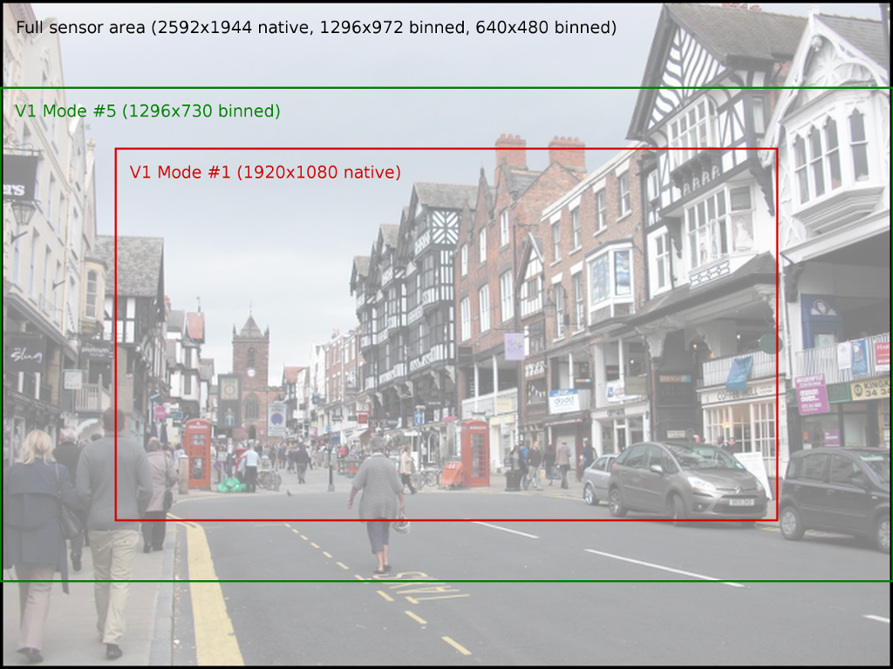
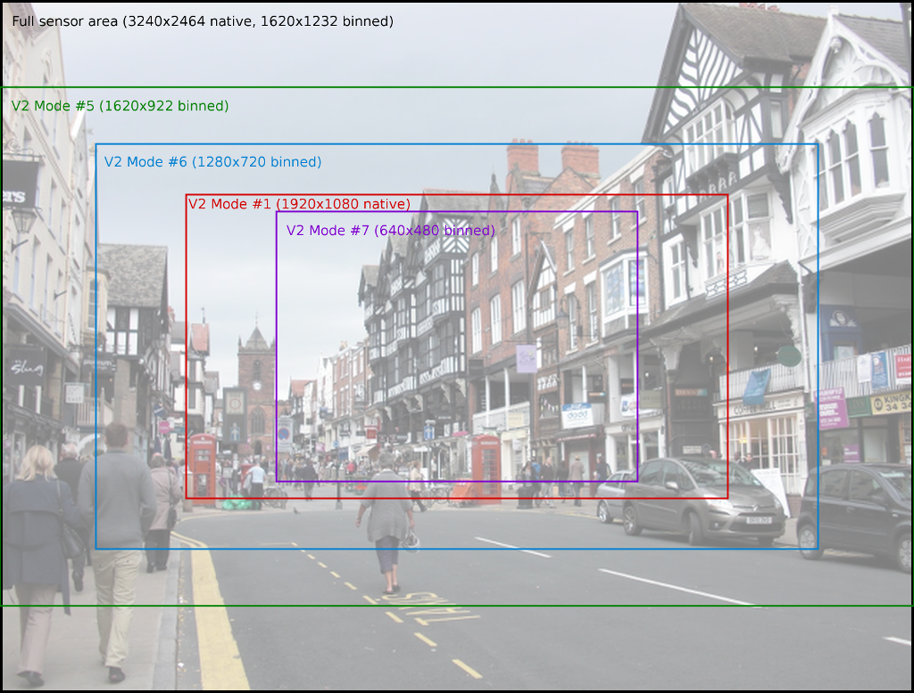

.. _camera_hardware:

===============
Camera Hardware
===============

.. currentmodule:: picamera

This chapter attempts to provide an overview of the operation of the camera
under various conditions, as well as to provide an introduction to the low
level software interface that picamera utilizes.

.. _camera_modes:

Camera Modes
============

The Pi's camera has a discrete set of input modes. On the V1 camera these are
as follows:

+---+------------+--------------+-------------+-------+-------+---------+---------+
| # | Resolution | Aspect Ratio | Framerates  | Video | Image | FoV     | Binning |
+===+============+==============+=============+=======+=======+=========+=========+
| 1 | 1920x1080  | 16:9         | 1-30fps     | x     |       | Partial | None    |
+---+------------+--------------+-------------+-------+-------+---------+---------+
| 2 | 2592x1944  | 4:3          | 1-15fps     | x     | x     | Full    | None    |
+---+------------+--------------+-------------+-------+-------+---------+---------+
| 3 | 2592x1944  | 4:3          | 0.1666-1fps | x     | x     | Full    | None    |
+---+------------+--------------+-------------+-------+-------+---------+---------+
| 4 | 1296x972   | 4:3          | 1-42fps     | x     |       | Full    | 2x2     |
+---+------------+--------------+-------------+-------+-------+---------+---------+
| 5 | 1296x730   | 16:9         | 1-49fps     | x     |       | Full    | 2x2     |
+---+------------+--------------+-------------+-------+-------+---------+---------+
| 6 | 640x480    | 4:3          | 42.1-60fps  | x     |       | Full    | 4x4     |
+---+------------+--------------+-------------+-------+-------+---------+---------+
| 7 | 640x480    | 4:3          | 60.1-90fps  | x     |       | Full    | 4x4     |
+---+------------+--------------+-------------+-------+-------+---------+---------+

.. note::

    This table is accurate as of firmware revision #656. Firmwares prior to
    this had a more restricted set of modes, and all video modes had partial
    FoV. Please use ``sudo apt-get dist-upgrade`` to upgrade to the latest
    firmware.

On the V2 camera, these are:

+---+------------+--------------+------------+-------+-------+---------+---------+
| # | Resolution | Aspect Ratio | Framerates | Video | Image | FoV     | Binning |
+===+============+==============+============+=======+=======+=========+=========+
| 1 | 1920x1080  | 16:9         | 0.1-30fps  | x     |       | Partial | None    |
+---+------------+--------------+------------+-------+-------+---------+---------+
| 2 | 3240x2464  | 4:3          | 0.1-15fps  | x     | x     | Full    | None    |
+---+------------+--------------+------------+-------+-------+---------+---------+
| 3 | 3240x2464  | 4:3          | 0.1-15fps  | x     | x     | Full    | None    |
+---+------------+--------------+------------+-------+-------+---------+---------+
| 4 | 1620x1232  | 4:3          | 0.1-40fps  | x     |       | Full    | 2x2     |
+---+------------+--------------+------------+-------+-------+---------+---------+
| 5 | 1620x922   | 16:9         | 0.1-40fps  | x     |       | Full    | 2x2     |
+---+------------+--------------+------------+-------+-------+---------+---------+
| 6 | 1280x720   | 16:9         | 40-90fps   | x     |       | Partial | 2x2     |
+---+------------+--------------+------------+-------+-------+---------+---------+
| 7 | 640x480    | 4:3          | 40-90fps   | x     |       | Partial | 2x2     |
+---+------------+--------------+------------+-------+-------+---------+---------+

Modes with full field of view (FoV) capture from the whole area of the camera's
sensor (2592x1944 pixels for the V1 camera, 3240x2464 for the V2 camera).
Modes with partial FoV capture from the center of the sensor. The combination
of FoV limiting, and `binning`_ is used to achieve the requested resolution.

The image below illustrates the difference between full and partial FoV for
the V1 camera:

While the various FoVs for the V2 camera are illustrated in the following
image:

The input mode can be manually specified with the *sensor_mode* parameter in
the :class:`PiCamera` constructor (using one of the values from the # column in
the tables above). This defaults to 0 indicating that the mode should be
selected automatically based on the requested :attr:`~PiCamera.resolution` and
:attr:`~PiCamera.framerate`. The rules governing which input mode is selected
are as follows:

* The mode must be acceptable. Video modes can be used for video recording, or
  for image captures from the video port (i.e. when *use_video_port* is
  ``True`` in calls to the various capture methods). Image captures when
  *use_video_port* is ``False`` must use an image mode (of which only two
  exist, both with the maximum resolution).

* The closer the requested :attr:`~PiCamera.resolution` is to the mode's
  resolution the better, but downscaling from a higher input resolution is
  preferable to upscaling from a lower input resolution.

* The requested :attr:`~PiCamera.framerate` should be within the range of the
  input mode. Note that this is not a hard restriction (it is possible, but
  unlikely, for the camera to select a mode that does not support the requested
  framerate).

* The closer the aspect ratio of the requested :attr:`~PiCamera.resolution` to
  the mode's resolution, the better. Attempts to set resolutions with aspect
  ratios other than 4:3 or 16:9 (which are the only ratios directly supported
  by the modes in the table above) will choose the mode which maximizes the
  resulting FoV.

A few examples are given below to clarify the operation of this heuristic (note
these examples assume the V1 camera module):

* If you set the :attr:`~PiCamera.resolution` to 1024x768 (a 4:3 aspect ratio),
  and :attr:`~PiCamera.framerate` to anything less than 42fps, the 1296x972
  mode will be selected, and the camera will downscale the result to 1024x768.

* If you set the :attr:`~PiCamera.resolution` to 1280x720 (a 16:9 wide-screen
  aspect ratio), and :attr:`~PiCamera.framerate` to anything less than 49fps,
  the 1296x730 mode will be selected and downscaled appropriately.

* Setting :attr:`~PiCamera.resolution` to 1920x1080 and
  :attr:`~PiCamera.framerate` to 30fps exceeds the resolution of both the
  1296x730 and 1296x972 modes (i.e. they would require upscaling), so the
  1920x1080 mode is selected instead, although it has a reduced FoV.

* A :attr:`~PiCamera.resolution` of 800x600 and a :attr:`~PiCamera.framerate`
  of 60fps will select the 640x480 60fps mode, even though it requires
  upscaling because the algorithm considers the framerate to take precedence in
  this case.

* Any attempt to capture an image without using the video port will
  (temporarily) select the 2592x1944 mode while the capture is performed (this
  is what causes the flicker you sometimes see when a preview is running while
  a still image is captured).

.. _binning: http://www.andor.com/learning-academy/ccd-binning-what-does-binning-mean

.. _under_the_hood:

Under the Hood
==============

This section attempts to provide detail of what picamera is doing "under the
hood" in response to various method calls.

The Pi's camera has three ports, the still port, the video port, and the
preview port. The following sections describe how these ports are used by
picamera and how they influence the camera's resolutions.

The Still Port
--------------

Firstly, the still port. Whenever this is used to capture images, it (briefly)
forces the camera's mode to one of the two supported still modes (see
:ref:`camera_modes`) so that images are captured using the full area of the
sensor. It also uses a strong de-noise algorithm on captured images so that
they appear higher quality.

The still port is used by the various :meth:`~PiCamera.capture` methods when
their *use_video_port* parameter is ``False`` (which it is by default).

The Video Port
--------------

The video port is somewhat simpler in that it never changes the camera's mode.
The video port is used by the :meth:`~PiCamera.start_recording` method (for
recording video), and is also used by the various :meth:`~PiCamera.capture`
methods when their *use_video_port* parameter is ``True``. Images captured from
the video port tend to have a "grainy" appearance, much more akin to a video
frame than the images captured by the still port (this is due to the still port
using a slower, more aggressive denoise algorithm).

The Preview Port
----------------

The preview port operates more or less identically to the video port. The
preview port is always connected to some form of output to ensure that the
auto-gain algorithm can run. When an instance of :class:`PiCamera` is
constructed, the preview port is initially connected to an instance of
:class:`PiNullSink`.  When :meth:`~PiCamera.start_preview` is called, this null
sink is destroyed and the preview port is connected to an instance of
:class:`~PiPreviewRenderer`. The reverse occurs when
:meth:`~PiCamera.stop_preview` is called.

Encoders
--------

The camera provides various encoders which can be attached to the still and
video ports for the purpose of producing output (e.g. JPEG images or H.264
encoded video). A port can have a single encoder attached to it at any given
time (or nothing if the port is not in use).

Encoders are connected directly to the still port. For example, when capturing
a picture using the still port, the camera's state conceptually moves through
these states:

.. image:: still_port_capture.*
    :align: center

As you have probably noticed in the diagram above, the video port is a little
more complex. In order to permit simultaneous video recording and image capture
via the video port, a "splitter" component is permanently connected to the
video port by picamera, and encoders are in turn attached to one of its four
output ports (numbered 0, 1, 2, and 3). Hence, when recording video the
camera's setup looks like this:

.. image:: video_port_record.*
    :align: center

And when simultaneously capturing images via the video port whilst recording,
the camera's configuration moves through the following states:

.. image:: video_port_capture.*
    :align: center

When the ``resize`` parameter is passed to one of the aforementioned methods, a
resizer component is placed between the camera's ports and the encoder, causing
the output to be resized before it reaches the encoder. This is particularly
useful for video recording, as the H.264 encoder cannot cope with full
resolution input (the GPU hardware can only handle frame widths up to 1920
pixels). Hence, when performing full frame video recording, the camera's setup
looks like this:

.. image:: video_fullfov_record.*
    :align: center

Finally, when performing unencoded captures an encoder is (naturally) not
required.  Instead data is taken directly from the camera's ports. However,
various firmware limitations require acrobatics in the pipeline to achieve
requested encodings.

For example, in older firmwares the camera's still port cannot be configured
for RGB output (due to a faulty buffer size check). However, they can be
configured for YUV output so in this case picamera configures the still port
for YUV output, attaches as resizer (configured with the same input and output
resolution), then configures the resizer's output for RGBA (the resizer doesn't
support RGB for some reason). It then runs the capture and strips the redundant
alpha bytes off the data.

Recent firmwares fix the buffer size check, so with these picamera will
simply configure the still port for RGB output (since 1.11):

.. image:: still_raw_capture.*
    :align: center

Encodings
---------

A further complication is the "OPAQUE" encoding. This is the most efficient
encoding to use when connecting MMAL components as it simply passes pointers
around under the hood rather than full frame data. However, not all OPAQUE
encodings are equivalent:

* The preview port's OPAQUE encoding contains a single image.

* The video port's OPAQUE encoding contains two images (used for motion
  estimation by various encoders).

* The still port's OPAQUE encoding contains strips of a single image.

* The JPEG image encoder accepts the still port's OPAQUE strips format.

* The MJPEG video encoder does *not* accept the OPAQUE strips format, only
  the single and dual image variants provided by the preview or video ports.

* The H264 video encoder in older firmwares only accepts the dual image
  OPAQUE format (it will accept full-frame YUV input instead though). In newer
  firmwares it now accepts the single image OPAQUE format too (presumably
  constructing the second image itself for motion estimation).

* The splitter accepts single or dual image OPAQUE input, but only outputs
  single image OPAQUE input (or YUV; in later firmwares it also
  supports RGB or BGR output).

* The resizer theoretically accepts OPAQUE input (though the author hasn't
  managed to get this working at the time of writing) but will only produce
  YUV/RGBA/BGRA output.

The new ``mmalobj`` layer introduced in picamera 1.11 is aware of these OPAQUE
encoding differences and attempts to configure connections between components
with the most efficient formats possible. However, it is not aware of firmware
revisions so if you're playing with MMAL components via this layer be prepared
to do some tinkering to get your pipeline working.

Please note that even the description above is almost certainly far removed
from what actually happens at the camera's ISP level. Rather, what has been
described in this section is how the MMAL library exposes the camera to
applications which utilize it (these include the picamera library, along with
the official ``raspistill`` and ``raspivid`` applications).

In other words, by using picamera you are passing through (at least) two
abstraction layers which necessarily obscure (but hopefully simplify) the
"true" operation of the camera.

