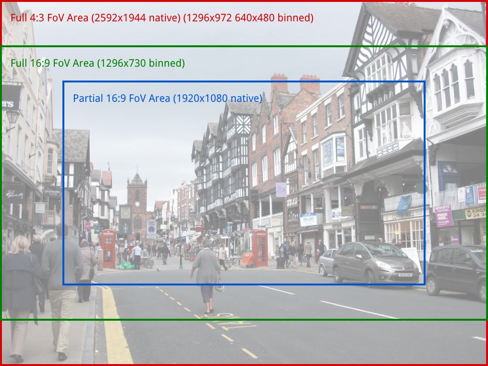
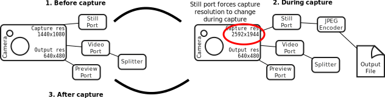
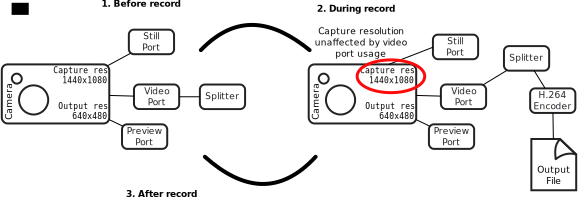
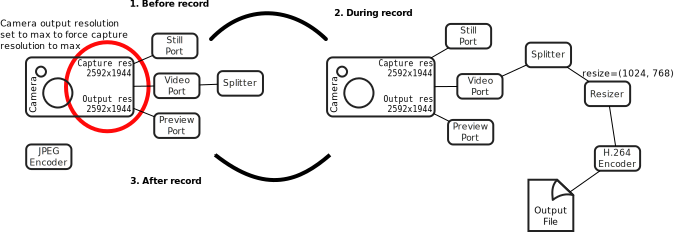
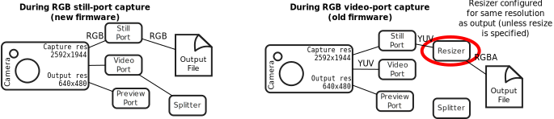

.. _camera_hardware:

===============
Camera Hardware
===============

This chapter attempts to provide an overview of the operation of the camera
under various conditions, as well as to provide an introduction to the low
level software interface that picamera utilizes.

.. _camera_modes:

Camera Modes
============

The Pi's camera has a discrete set of input modes which are as follows:

+------------+--------------+------------+-------+-------+---------+
| Resolution | Aspect Ratio | Framerates | Video | Image | FoV     |
+============+==============+============+=======+=======+=========+
| 2592x1944  | 4:3          | 1-15fps    | x     | x     | Full    |
+------------+--------------+------------+-------+-------+---------+
| 1296x972   | 4:3          | 1-42fps    | x     |       | Full    |
+------------+--------------+------------+-------+-------+---------+
| 1296x730   | 16:9         | 1-49fps    | x     |       | Full    |
+------------+--------------+------------+-------+-------+---------+
| 640x480    | 4:3          | 42.1-60fps | x     |       | Full    |
+------------+--------------+------------+-------+-------+---------+
| 640x480    | 4:3          | 60.1-90fps | x     |       | Full    |
+------------+--------------+------------+-------+-------+---------+
| 1920x1080  | 16:9         | 1-30fps    | x     |       | Partial |
+------------+--------------+------------+-------+-------+---------+

.. note::

    This table is accurate as of firmware revision #656. Firmwares prior to
    this had a more restricted set of modes, and all video modes had partial
    FoV. Please use ``sudo rpi-update`` to upgrade to the latest firmware.

Modes with full field of view (FoV) capture from the whole area of the
camera's sensor (2592x1944 pixels). Modes with partial FoV only capture from
the center 1920x1080 pixels. The difference between these areas is shown in the
illustration below:

Which input mode is used cannot be *directly* controlled, but is selected based
on the requested :attr:`~picamera.PiCamera.resolution` and
:attr:`~picamera.PiCamera.framerate`. The rules governing which input mode is
selected are as follows:

* The mode must be acceptable. Video modes can be used for video recording,
  or for image captures from the video port (i.e. when *use_video_port* is
  ``True`` in calls to the various capture methods). Image captures when
  *use_video_port* is ``False`` must use an image mode (of which only one
  currently exists).

* The closer the requested :attr:`~picamera.PiCamera.resolution` is to the
  mode's resolution the better, but downscaling from a higher input resolution
  is preferable to upscaling from a lower input resolution.

* The requested :attr:`~picamera.PiCamera.framerate` should be within the
  range of the input mode. Note that this is not a hard restriction (it is
  possible, but unlikely, for the camera to select a mode that does not support
  the requested framerate).

* The closer the aspect ratio of the requested
  :attr:`~picamera.PiCamera.resolution` is to the mode's resolution, the
  better. Attempts to set resolutions with aspect ratios other than 4:3 or 16:9
  (which are the only ratios directly supported by the modes in the table
  above) will choose the mode which maximizes the resulting FoV.

A few examples are given below to clarify the operation of this heuristic:

* If you set the :attr:`~picamera.PiCamera.resolution` to 1024x768 (a 4:3
  aspect ratio), and :attr:`~picamera.PiCamera.framerate` to anything less than
  42fps, the 1296x976 mode will be selected, and the camera will downscale the
  result to 1024x768.

* If you set the :attr:`~picamera.PiCamera.resolution` to 1280x720 (a 16:9
  wide-screen aspect ratio), and :attr:`~picamera.PiCamera.framerate` to
  anything less than 49fps, the 1296x730 mode will be selected and downscaled
  appropriately.

* Setting :attr:`~picamera.PiCamera.resolution` to 1920x1080 and
  :attr:`~picamera.PiCamera.framerate` to 30fps exceeds the resolution of both
  the 1296x730 and 1296x976 modes (i.e. they would require upscaling), so the
  1920x1080 mode is selected instead, although it has a reduced FoV.

* A :attr:`~picamera.PiCamera.resolution` of 800x600 and a
  :attr:`~picamera.PiCamera.framerate` of 60fps will select the 640x480 60fps
  mode, even though it requires upscaling because the algorithm considers the
  framerate to take precedence in this case.

* Any attempt to capture an image without using the video port will
  (temporarily) select the 2592x1944 mode while the capture is performed (this
  is what causes the flicker you sometimes see when a preview is running while
  a still image is captured).

.. _under_the_hood:

Under the Hood
==============

This section attempts to provide detail of what picamera is doing "under the
hood" in response to various method calls.

The Pi's camera has three ports, the still port, the video port, and the
preview port. The following sections describe how these ports are used by
picamera and how they influence the camera's resolutions.

The Still Port
--------------

Firstly, the still port. Whenever this is used to capture images, it (briefly)
forces the camera's mode to the only supported still mode (see
:ref:`camera_modes`) so that images are captured using the full area of the
sensor. It also appears to perform a considerable amount of post-processing on
captured images so that they appear higher quality.

The still port is used by the various :meth:`~picamera.PiCamera.capture`
methods when their ``use_video_port`` parameter is ``False`` (which it is by
default).

The Video Port
--------------

The video port is somewhat simpler in that it never changes the camera's mode.
The video port is used by the :meth:`~picamera.PiCamera.start_recording` method
(for recording video), and is also used by the various
:meth:`~picamera.PiCamera.capture` methods when their ``use_video_port``
parameter is ``True``. Images captured from the video port tend to have a
"grainy" appearance, much more akin to a video frame than the images captured
by the still port (the author suspects the still port may be taking an average
of several frames).

The Preview Port
----------------

The preview port operates more or less identically to the video port. As the
preview port is never used for encoding we won't mention it further in this
section.

Encoders
--------

The camera provides various encoders which can be attached to the still and
video ports for the purpose of producing output (e.g. JPEG images or H.264
encoded video). A port can have a single encoder attached to it at any given
time (or nothing if the port is not in use).

Encoders are connected directly to the still port. For example, when capturing
a picture using the still port, the camera's state conceptually moves through
these states:

As you have probably noticed in the diagram above, the video port is a little
more complex. In order to permit simultaneous video recording and image capture
via the video port, a "splitter" component is permanently connected to the
video port by picamera, and encoders are in turn attached to one of its four
output ports (numbered 0, 1, 2, and 3). Hence, when recording video the
camera's setup looks like this:

And when simultaneously capturing images via the video port whilst recording,
the camera's configuration moves through the following states:

.. image:: video_port_capture.svg
    :align: center

When the ``resize`` parameter is passed to one of the aforementioned methods, a
resizer component is placed between the camera's ports and the encoder, causing
the output to be resized before it reaches the encoder. This is particularly
useful for video recording, as the H.264 encoder cannot cope with full
resolution input. Hence, when performing full frame video recording, the
camera's setup looks like this:

Finally, when performing raw captures an encoder is (naturally) not required.
Instead data is taken directly from the camera's ports. When raw YUV format is
requested no components are attached to the ports at all (as the ports are
configured for YUV output at all times). When another raw format like RGBA is
requested, a resizer is used (with its output resolution set to the input
resolution, unless the ``resize`` option is specified with something
different), and its output format is set to the requested raw format:

Please note that even the description above is almost certainly far removed
from what actually happens at the camera's ISP level. Rather, what has been
described in this section is how the MMAL library exposes the camera to
applications which utilize it (these include the picamera library, along with
the official `raspistill` and `raspivid` applications).

In other words, by using picamera you are passing through (at least) two
abstraction layers which necessarily obscure (but hopefully simplify) the
"true" operation of the camera.

