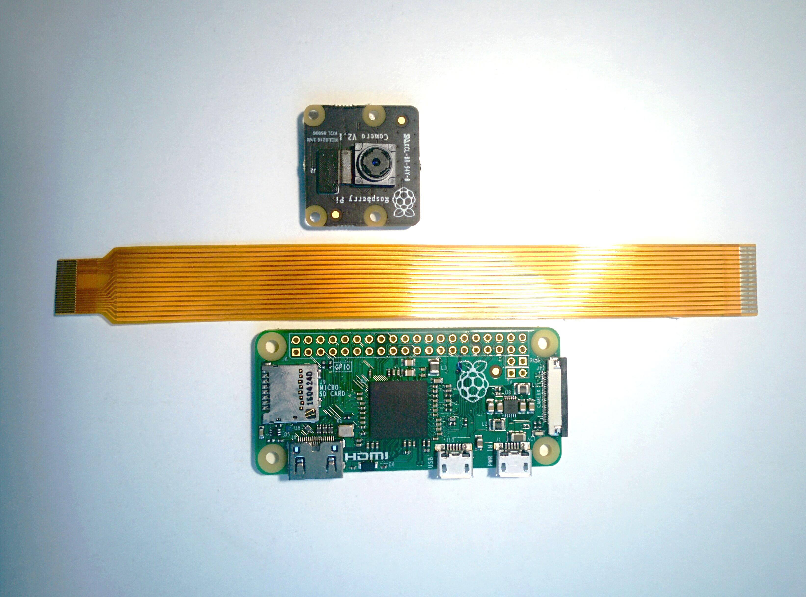
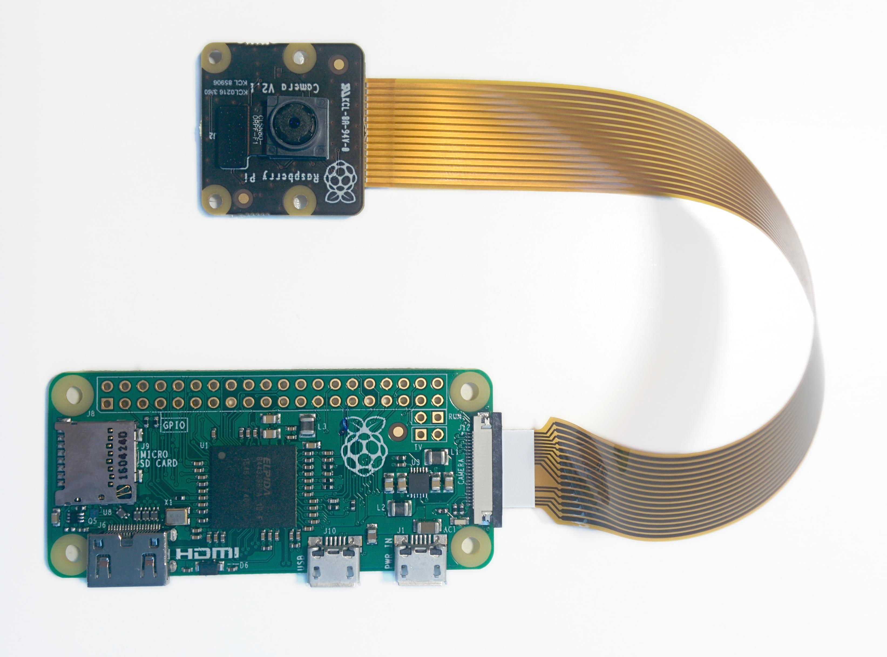

.. _quickstart:

===============
Getting Started
===============

.. warning::

    Make sure your Pi is off while installing the camera module. Although it is
    possible to install the camera while the Pi is on, this isn't good practice
    (if the camera is active when removed, it's possible to damage it).

Connect your camera module to the CSI port on your Raspberry Pi; this is the
long thin port adjacent to the HDMI socket. Gently lift the collar on top of
the CSI port (if it comes off, don't worry, you can push it back in but try to
be more gentle in future!). Slide the ribbon cable of the camera module into
the port with the blue side facing the Ethernet port (or where the Ethernet
port would be if you've got a model A/A+).

Once the cable is seated in the port, press the collar back down to lock the
cable in place. If done properly you should be able to easily lift the Pi by
the camera's cable without it falling out. The following illustrations show
a well-seated camera cable with the correct orientation:

.. image:: images/good_connection.jpg
    :width: 640px
    :align: center

Make sure the camera module isn't sat on anything conductive (e.g. the Pi's
USB ports or its GPIO pins).

Pi Zero
=======

The 1.2 model of the `Raspberry Pi Zero`_ includes a small form-factor CSI port
which requires a `camera adapter cable`_.

To attach a camera module to a Pi Zero:

1. Remove the existing camera module's cable by gently lifting the collar on
   the camera module and pulling the cable out.

2. Next, insert the wider end of the adapter cable with the conductors facing
   in the same direction as the camera's lens.

3. Finally, attach the adapter to the Pi Zero by gently lifting the collar at
   the edge of the board (be careful with this as they are more delicate than
   the collars on the regular CSI ports) and inserting the smaller end of the
   adapter with the conductors facing the back of the Pi Zero.

Your setup should look something like this:

Testing
=======

Now, apply power to your Pi. Once booted, start the Raspberry Pi Configuration
utility and enable the camera module:

.. image:: images/enable_camera.png
    :align: center

You will need to reboot after doing this (but this is one-time setup so you
won't need to do it again unless you re-install your operating system or switch
SD cards). Once rebooted, start a terminal and try the following command:

.. code-block:: bash

    raspistill -o image.jpg

If everything is working correctly, the camera should start, a preview from the
camera should appear on the display and, after a 5 second delay it should
capture an image (storing it as ``image.jpg``) before shutting down the camera.
Proceed to the :ref:`recipes1`.

If something else happens, read any error message displayed and try any
recommendations suggested by such messages. If your Pi reboots as soon as you
run this command, your power supply is insufficient for running your Pi plus
the camera module (and whatever other peripherals you have attached).

.. _Raspberry Pi Zero: https://www.raspberrypi.org/products/pi-zero/
.. _camera adapter cable: https://shop.pimoroni.com/products/camera-cable-raspberry-pi-zero-edition
