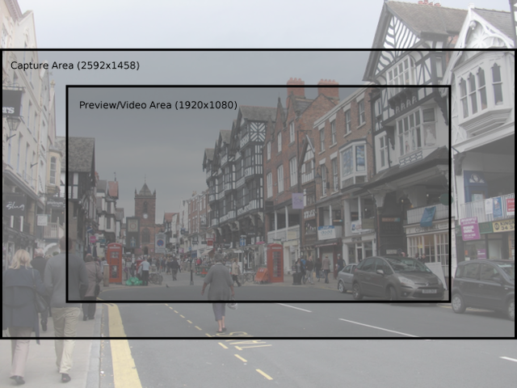

.. _recipes1:

=============
Basic Recipes
=============

The following recipes should be reasonably accessible to Python programmers of
all skill levels. Please feel free to suggest enhancements or additional
recipes.

.. _stream_capture:

Capturing to a stream
=====================

Capturing to a file-like object (a socket, a :class:`io.BytesIO` stream, an
existing open file object, etc.) is as simple as specifying that object as the
output of whatever capture() method you're using::

    import io
    import time
    import picamera

    # Create an in-memory stream
    my_stream = io.BytesIO()
    with picamera.PiCamera() as camera:
        camera.start_preview()
        # Camera warm-up time
        time.sleep(2)
        camera.capture(my_stream, 'jpeg')

Note that the format is explicitly specified in the case above. The BytesIO
object has no filename, so the camera can't automatically figure out what
format to use.

One thing to bear in mind is that (unlike specifying a filename), the stream is
*not* automatically closed after capture; picamera assumes that since it didn't
open the stream it can't presume to close it either. In the case of file
objects this can mean that the data doesn't actually get written to the disk
until the object is explicitly closed::

    import time
    import picamera

    # Create a new file called my_image.jpg
    my_file = open('my_image.jpg', 'wb')
    with picamera.PiCamera() as camera:
        camera.start_preview()
        time.sleep(2)
        camera.capture(my_file)
    # Note that at this point the data is in the file cache, but may
    # not actually have been written to disk yet
    my_file.close()
    # Now the file has been closed, other processes should be able to
    # read the image successfully

Note that in the case above, we didn't have to specify the format as the camera
interrogated the ``my_file`` object for its filename (specifically, it looks
for a ``name`` attribute on the provided object).

.. _pil_capture:

Capturing to a PIL Image
========================

This is a variation on :ref:`stream_capture`. First we'll capture an image to
a BytesIO stream (Python's in-memory stream class), then we'll rewind the
position of the stream to the start, and read the stream into a `PIL`_ Image
object::

    import io
    import time
    import picamera
    from PIL import Image

    # Create the in-memory stream
    stream = io.BytesIO()
    with picamera.PiCamera() as camera:
        camera.start_preview()
        time.sleep(2)
        camera.capture(stream, format='jpeg')
    # "Rewind" the stream to the beginning so we can read its content
    stream.seek(0)
    image = Image.open(stream)

.. _opencv_capture:

Capturing to an OpenCV object
=============================

This is another variation on :ref:`stream_capture`. First we'll capture an
image to a BytesIO stream (Python's in-memory stream class), then convert the
stream to a numpy array and read the array with `OpenCV`_::

    import io
    import time
    import picamera
    import cv2
    import numpy as np

    # Create the in-memory stream
    stream = io.BytesIO()
    with picamera.PiCamera() as camera:
        camera.start_preview()
        time.sleep(2)
        camera.capture(stream, format='jpeg')
    # Construct a numpy array from the stream
    data = np.fromstring(stream.getvalue(), dtype=np.uint8)
    # "Decode" the image from the array
    image = cv2.imdecode(data, 1)
    # OpenCV returns an array with data in BGR order. If you want RGB instead
    # use the following...
    image = image[:, :, ::-1]

.. _timelapse_capture:

Capturing timelapse sequences
=============================

The simplest way to capture long time-lapse sequences is with the
:meth:`~picamera.PiCamera.capture_continuous` method. With this method, the
camera captures images continually until you tell it to stop. Images are
automatically given unique names and you can easily control the delay between
captures. The following example shows how to capture images with a 5 minute
delay between each shot::

    import time
    import picamera

    with picamera.PiCamera() as camera:
        camera.start_preview()
        time.sleep(2)
        for filename in camera.capture_continuous('img{counter:03d}.jpg'):
            print('Captured %s' % filename)
            time.sleep(300) # wait 5 minutes

However, you may wish to capture images at a particular time, say at the start
of every hour. This simply requires a refinement of the delay in the loop (the
:mod:`datetime` module is slightly easier to use for calculating dates and
times; this example also demonstrates the ``timestamp`` template in the
captured filenames)::

    import time
    import picamera
    from datetime import datetime, timedelta

    def wait():
        # Calculate the delay to the start of the next hour
        next_hour = (datetime.now() + timedelta(hour=1)).replace(
            minute=0, second=0, microsecond=0)
        delay = (next_hour - datetime.now()).seconds
        time.sleep(delay)

    with picamera.PiCamera() as camera:
        camera.start_preview()
        wait()
        for filename in camera.capture_continuous('img{timestamp:%Y-%m-%d-%H-%M}.jpg'):
            print('Captured %s' % filename)
            wait()

.. _streaming_capture:

Capturing to a network stream
=============================

This is a variation of :ref:`timelapse_capture`. Here we have two scripts: a
server (presumably on a fast machine) which listens for a connection from the
Raspberry Pi, and a client which runs on the Raspberry Pi and sends a continual
stream of images to the server. Firstly the server script (which relies on PIL
for reading JPEGs, but you could replace this with any other suitable graphics
library, e.g. OpenCV or GraphicsMagick)::

    import io
    import socket
    import struct
    from PIL import Image

    # Start a socket listening for connections on 0.0.0.0:8000 (0.0.0.0 means
    # all interfaces)
    server_socket = socket.socket()
    server_socket.bind(('0.0.0.0', 8000))
    server_socket.listen(0)

    # Accept a single connection and make a file-like object out of it
    connection = server_socket.accept()[0].makefile('rb')
    try:
        while True:
            # Read the length of the image as a 32-bit unsigned int. If the
            # length is zero, quit the loop
            image_len = struct.unpack('<L', connection.read(4))[0]
            if not image_len:
                break
            # Construct a stream to hold the image data and read the image
            # data from the connection
            image_stream = io.BytesIO()
            image_stream.write(connection.read(image_len))
            # Rewind the stream, open it as an image with PIL and do some
            # processing on it
            image_stream.seek(0)
            image = Image.open(image_stream)
            print('Image is %dx%d' % image.size)
            image.verify()
            print('Image is verified')
    finally:
        connection.close()
        server_socket.close()

Now for the client side of things, on the Raspberry Pi::

    import io
    import socket
    import struct
    import time
    import picamera

    # Connect a client socket to my_server:8000 (change my_server to the
    # hostname of your server)
    client_socket = socket.socket()
    client_socket.connect(('my_server', 8000))

    # Make a file-like object out of the connection
    connection = client_socket.makefile('wb')
    try:
        with picamera.PiCamera() as camera:
            camera.resolution = (640, 480)
            # Start a preview and let the camera warm up for 2 seconds
            camera.start_preview()
            time.sleep(2)

            # Note the start time and construct a stream to hold image data
            # temporarily (we could write it directly to connection but in this
            # case we want to find out the size of each capture first to keep
            # our protocol simple)
            start = time.time()
            stream = io.BytesIO()
            for foo in camera.capture_continuous(stream, 'jpeg'):
                # Write the length of the capture to the stream and flush to
                # ensure it actually gets sent
                connection.write(struct.pack('<L', stream.tell()))
                connection.flush()
                # Rewind the stream and send the image data over the wire
                stream.seek(0)
                connection.write(stream.read())
                # If we've been capturing for more than 30 seconds, quit
                if time.time() - start > 30:
                    break
                # Reset the stream for the next capture
                stream.seek(0)
                stream.truncate()
        # Write a length of zero to the stream to signal we're done
        connection.write(struct.pack('<L', 0))
    finally:
        connection.close()
        client_socket.close()

The server script should be run first to ensure there's a listening socket
ready to accept a connection from the client script.

.. _preview_still_resolution:

Preview vs Still resolution
===========================

One thing you may have noted while experimenting with the camera's preview mode
is that captured images typically show more than the preview. The reason for
this is that the camera does not (usually) use the full sensor area for preview
or video captures, but does for image captures. Specifically, the camera's
sensor has a resolution of 2592x1944 pixels (approximately 5 mega-pixels in
area), but only the 1920x1080 pixels in the center of the sensor are used for
previews or video:

.. image:: sensor_area.png
    :width: 640px
    :align: center

When still images are captured, the full sensor area is used and the resulting
image is scaled to the requested resolution. This usually results in a
considerably larger field of view being observed in the final image than was
present in the preview shown before the capture. The following image shows the
preview area for the 1920x1080 resolution, and the resulting capture area
(which is scaled to 1920x1080 during capture):

The main method of mitigating this effect is to force the preview to use the
full sensor area. This can be done by setting
:attr:`~picamera.PiCamera.resolution` to 2592x1944 (this must be done before
starting the preview as resolution can only be set when the camera is idle)::

    import time
    import picamera

    with picamera.PiCamera() as camera:
        camera.resolution = (2592, 1944)
        # The following is equivalent
        #camera.resolution = camera.MAX_IMAGE_RESOLUTION
        camera.start_preview()
        time.sleep(2)
        camera.capture('foo.jpg')

When the preview runs at full resolution, you may notice that the framerate is
a little lower (specifically it is set to 15fps), however captures will show
the same content as the preview before hand. The main downside to this method
is that captured images are obviously full resolution. If you want something
smaller than full resolution, post scaling and/or cropping (e.g. in `PIL`_) is
required.

.. _PIL: http://effbot.org/imagingbook/pil-index.htm
.. _OpenCV: http://opencv.org/
